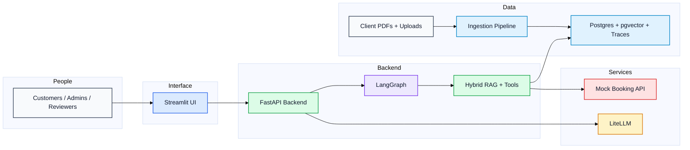

# ServiceFlow AI

ServiceFlow AI is the Meridian Home Services assistant for grounded FAQ answering, clarification, service-area lookup, booking, HITL review, and traceable retrieval.

## Submission At A Glance

- `docker compose up` starts Postgres, API, Streamlit, and LiteLLM.
- The main customer path is retrieval-grounded answering with citations.
- Booking and reschedule flows require explicit confirmation before commit.
- Knowledge uploads run through the backend ingestion pipeline and store chunks and embeddings in Postgres.
- Reviewer tooling is exposed in Streamlit for retrieval, HITL, prompts, evals, monitoring, and conversation state.

## Live Architecture

GitHub renders the Mermaid diagram below directly, so the README stays readable without opening extra tools.



Editable diagram source:

- [Mermaid source](docs/architecture/serviceflow-ai.mmd)
- [Draw.io source](docs/architecture/serviceflow-ai.drawio)
- [Rendered SVG](docs/architecture/serviceflow-ai.svg)

## Quick Start

1. Copy `.env.example` to `.env` if you need to customize settings.
2. Start the stack:

```bash
docker compose up -d --build
```

3. Open the services:

```text
API health: http://localhost:8000/api/health
Streamlit: http://localhost:8501
LiteLLM: http://localhost:4000
```

4. Try the live API endpoints:

```text
POST http://localhost:8000/api/v1/chat
POST http://localhost:8000/api/v1/retrieval/test
```

## Manual Test Paths

<details>
<summary>Streamlit pages to review</summary>

- Chat: `http://localhost:8501/Chat`
- Knowledge upload: `http://localhost:8501/Knowledge_Upload`
- Chunk explorer: `http://localhost:8501/Chunk_Explorer`
- Retrieval debugger: `http://localhost:8501/Retrieval_Debugger`
- HITL review: `http://localhost:8501/HITL_Review`
- Tool registry: `http://localhost:8501/Tool_Registry`
- Evals: `http://localhost:8501/Evals`
- Monitoring: `http://localhost:8501/Monitoring`
- Prompt audit: `http://localhost:8501/Prompt_Audit`
- Conversation state: `http://localhost:8501/Conversation_State`

Each page keeps business logic in the backend and uses the UI for inspection and control.
</details>

<details>
<summary>Happy path queries</summary>

Retrieval-grounded answers:

- What does a 40 gallon water heater replacement cost?
- What are Herndon Saturday hours?
- What is the no-show fee?
- What is the emergency line?
- What does a panel upgrade from 100A to 200A cost?

Service-area and booking:

- Do you service 20147 for plumbing?
- Book an HVAC tune-up in 22030 for 2026-07-02 morning.

Booking behavior:

- The first write request returns `awaiting_confirmation`.
- Open `HITL Review`.
- Approve the pending request to commit the mock booking.
- Use `Monitoring` with the returned `trace_id` to inspect graph and tool events.
</details>

<details>
<summary>Knowledge upload and evals</summary>

- Open `Knowledge Upload`.
- Upload a PDF.
- Confirm the ingestion report shows chunks and embeddings.
- Open `Chunk Explorer` and verify the new chunks are visible.
- Open `Evals`.
- Click `Run scenario evals`.
- Review the latest metrics row and `eval_results.md`.
</details>

<details>
<summary>Tool registry and tracing</summary>

- Open `Tool Registry`.
- Disable `check_service_area`.
- Run a service-area check from `Chat`; it should fail with a disabled-tool error.
- Re-enable the tool before continuing tests.
- Use `Monitoring` to inspect traces, retrieval, prompt events, and tool calls.
</details>

## Supporting Docs

| File | Purpose |
| --- | --- |
| [docs/README.md](docs/README.md) | Documentation index for reviewers |
| [ARCHITECTURE.md](ARCHITECTURE.md) | Core boundaries and runtime summary |
| [PATH_TO_PRODUCTION.md](PATH_TO_PRODUCTION.md) | Hardening and scaling plan |
| [DEBUGGING_METHODOLOGY.md](DEBUGGING_METHODOLOGY.md) | How to isolate failures quickly |
| [GUARDRAILS.md](GUARDRAILS.md) | Safety and traceability guardrails |
| [PROMPT_AUDIT.md](PROMPT_AUDIT.md) | Prompt registry and audit notes |
| [eval_results.md](eval_results.md) | Latest offline evaluation summary |

## Useful Commands

Run the full test suite:

```bash
python -m pytest -q
```

Run the scenario eval harness:

```bash
python -m pytest tests/test_eval_harness.py -q
```

Run the Streamlit/operator endpoint tests:

```bash
python -m pytest tests/test_streamlit_operator_endpoints.py tests/test_streamlit_ops_ui.py -q
```

Re-embed client PDFs with FastEmbed:

```powershell
@'
from pathlib import Path
from app.db.session import make_engine, make_sessionmaker
from app.rag.reembed import reembed_directory

engine = make_engine()
SessionLocal = make_sessionmaker(engine)
session = SessionLocal()
try:
    print(reembed_directory(Path("sl_docs"), db=session))
finally:
    session.close()
'@ | python -
```

Inspect traces and retrieval:

```text
GET /api/v1/traces
GET /api/v1/traces/{trace_id}
GET /api/v1/traces/{trace_id}/retrieval
GET /api/v1/traces/{trace_id}/tools
```

## Repository Layout

- `app/` backend, graph, RAG, tools, observability, and eval harness
- `prompts/` YAML prompt registry and prompt files
- `streamlit_app/` operator UI pages
- `evals/` JSONL eval datasets
- `sl_docs/` Meridian source PDFs
- `docs/` submission docs and architecture assets

## Key Design Decisions

- Hybrid retrieval is mandatory: FastEmbed dense vectors, Postgres full-text lexical search, and RRF fusion.
- Service-area eligibility is structured lookup only, never vector search.
- Write tools use Pydantic validation and stop at a human confirmation gate.
- Prompts live under `prompts/` and are versioned for auditability.
- Trace IDs connect chat, retrieval, prompt, graph, HITL, tool, and eval events.
- Streamlit is an operator UI, not a business-logic runtime.

## Assumptions

- V1 runs locally with Docker Compose and local Postgres.
- The mock booking API is intentionally local and deterministic.
- Uploaded documents are trusted operator/admin uploads for this case study.
- Free-tier LLM keys may be rate-limited, so automated live-LLM retries are intentionally low.
- `eval_data` and `test_data` remain available for evals but are excluded from customer-facing retrieval by default.

## What Is Deliberately Left Out

- `sentence-transformers`
- `torch`
- runtime `promptfoo`
- runtime `ragas`
- CrewAI
- AgentScope
- Mem0
- custom React frontend
- self-hosted Langfuse stack

See `PATH_TO_PRODUCTION.md`, `GUARDRAILS.md`, and `DEBUGGING_METHODOLOGY.md` for hardening, monitoring, and operating guidance.
